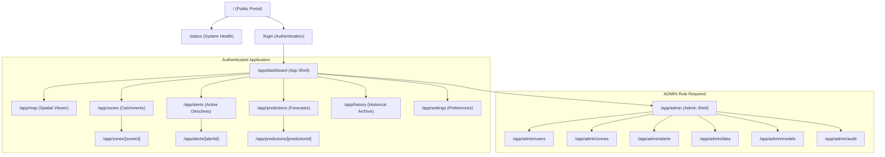

# Application Navigation & User Flow

```mermaid
graph TD
    PublicEntry["/ (Public Portal)"] --> Status["/status (System Health)"]
    PublicEntry --> Login["/login (Authentication)"]
    Login --> Dashboard["/app/dashboard (App Shell)"]

    subgraph Authenticated Application
        Dashboard --> Map["/app/map (Spatial Viewer)"]
        Dashboard --> Zones["/app/zones (Catchments)"]
        Zones --> ZoneDetail["/app/zones/[zoneId]"]
        Dashboard --> Alerts["/app/alerts (Active Directives)"]
        Alerts --> AlertDetail["/app/alerts/[alertId]"]
        Dashboard --> Predictions["/app/predictions (Forecasts)"]
        Predictions --> PredDetail["/app/predictions/[predictionId]"]
        Dashboard --> History["/app/history (Historical Archive)"]
        Dashboard --> Settings["/app/settings (Preferences)"]
    end

    subgraph Administration [ADMIN Role Required]
        Dashboard --> Admin["/app/admin (Admin Shell)"]
        Admin --> Users["/app/admin/users"]
        Admin --> AdminZones["/app/admin/zones"]
        Admin --> AdminAlerts["/app/admin/alerts"]
        Admin --> Data["/app/admin/data"]
        Admin --> Models["/app/admin/models"]
        Admin --> Audit["/app/admin/audit"]
    end
```
